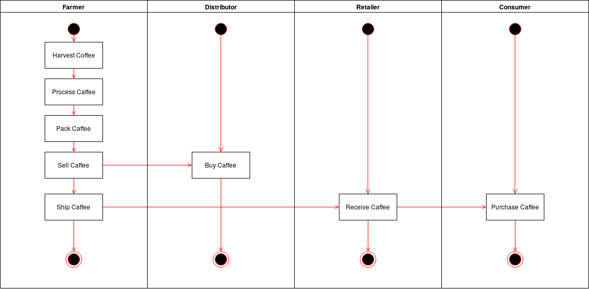
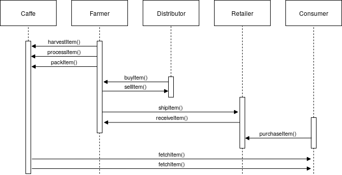
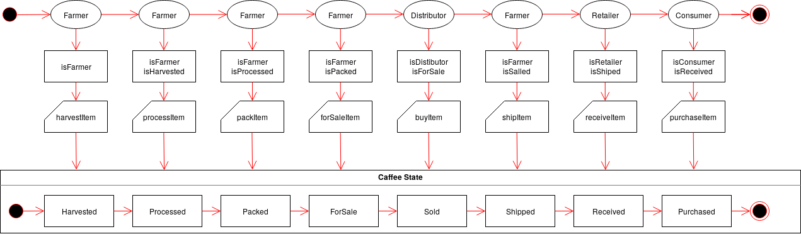
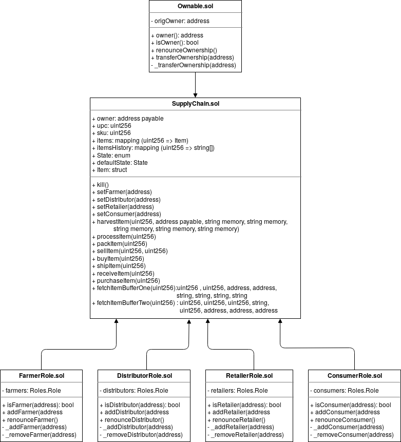
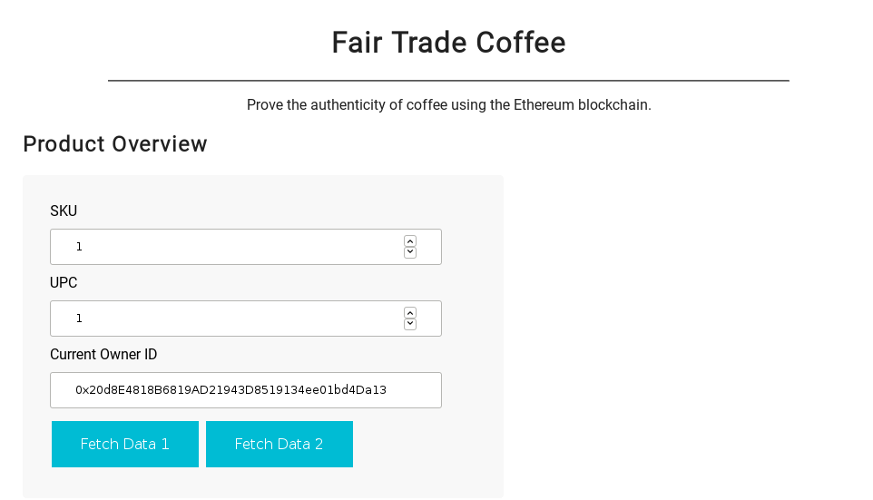
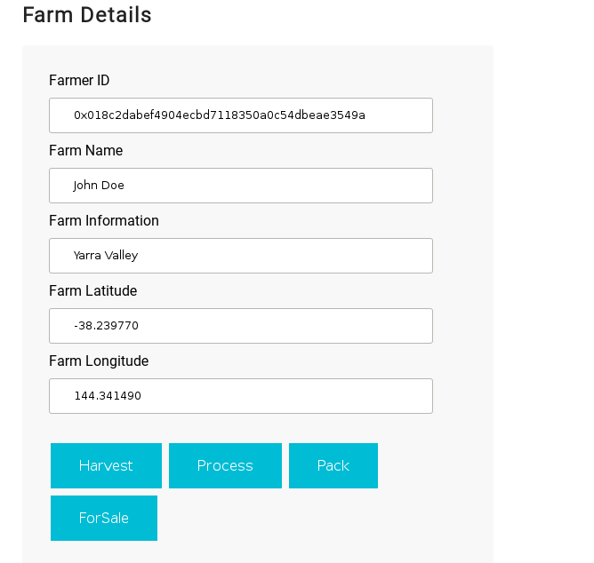
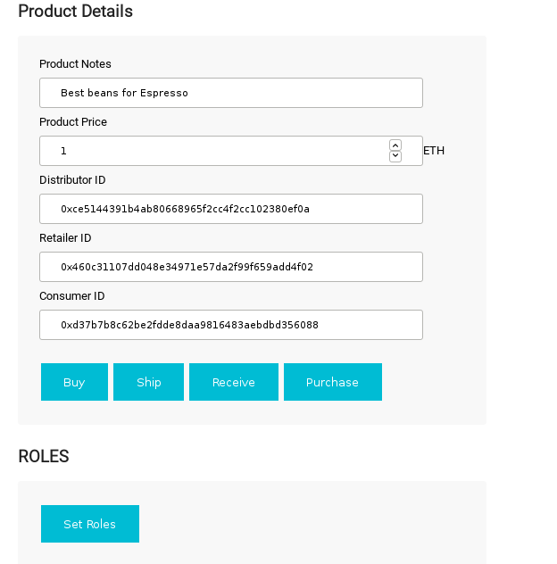
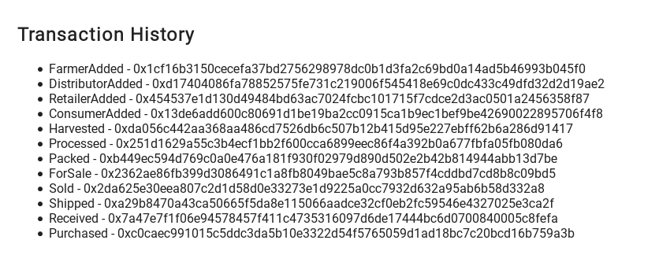
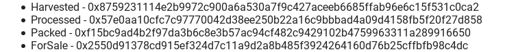
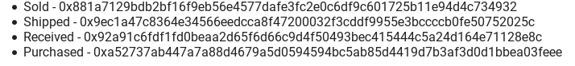

# Write-up

## Project Info

* SupplyChain addres : 0x78aEbB3aec7f7162F0BFE43B6C49BCC48D76a90e
* Rinkeby : https://rinkeby.etherscan.io/address/0x78aEbB3aec7f7162F0BFE43B6C49BCC48D76a90e

* Truffle v5.1.14-nodeLTS.0 (core: 5.1.13) with :
  * Solidity v0.5.16 (solc-js)
  * Node v12.16.1
  * Web3.js v1.2.1

## UML
Diagrams done with [https://app.diagrams.net/](https://app.diagrams.net/)

### Activity

### Sequence

### State

### Classes (Data Model)

## Libraries
* Roles. It makes easy to define and manage diferents roles in the SupplyChain : Farmer, Distributor, Retailerand Consumer.
* SafeMath from OpenZeppelin. An open source library to avoid Maths problems

## IPFS 
I did not use IPFS for this project. However. It is possible to use IPFS for :
  - Add HTML, CSS, and JS files to IPFS in order to fully decentralize the Supply Chain DAPP.
  - To have the caffee's pictures for each supply.
  
## General Description
### Rinkeby

SupplyChain addres : 0x78aEbB3aec7f7162F0BFE43B6C49BCC48D76a90e

Rinkeby link : https://rinkeby.etherscan.io/address/0x78aEbB3aec7f7162F0BFE43B6C49BCC48D76a90e

### Screens of the fornt End using Rinkeby network

The next accounts :
* "0x018c2dabef4904ecbd7118350a0c54dbeae3549a"
* "0xce5144391b4ab80668965f2cc4f2cc102380ef0a"
* "0x460c31107dd048e34971e57da2f99f659add4f02"

has been extracted from ganache-cli used in the testing phase (see how to get the private keys for this accounts  in https://github.com/udacity/nd1309-Project-6b-Example-Template) an exported in my Metamask.

#### Product Overview  with the contract owner account 

#### Farm Details

#### Product details 
The Set Roles Button let the contract owner add new farm , distributor and consumer in their respectives roles.

#### First group of transactions on Rinkeby
The next transactions are being done using the contract' Owner account "0x20d8E4818B6819AD21943D8519134ee01bd4Da13" for all the roles on Rinkebay network.

#### More Transactions on Rinkeby
Transactions done using the account "0x018C2daBef4904ECbd7118350A0c54DbeaE3549A" activated as Farmer Role.

 The contract Owner account "0x20d8E4818B6819AD21943D8519134ee01bd4Da13" act as Distributor, Retailer and Consumer.

